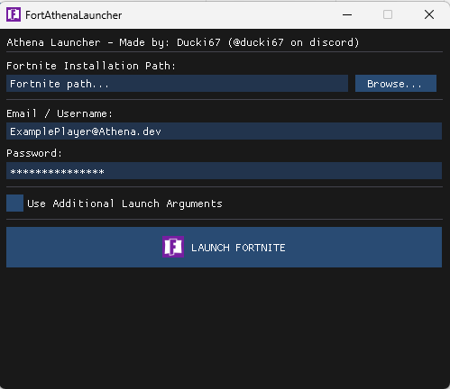
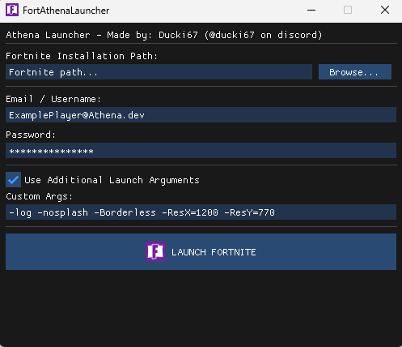

# AthenaLauncher
A very simple launcher made with C++ and Imgui

## UI

 -> Click here to view. <- 

  

  

Very basic pretty much :P

### Tested verions
My personal tests if the game launched and got in to lobby etc.

Note: this launcher never meant to support above ch1!
| Version | Status |
|-|-|
| 1.7.2 | Works |
| 1.8.2 | Works |
| 1.11 | Works |
| 3.6 | Works |
| 4.5 | Not tested but should work |
| 5.10 | Not tested but should work |
| 7.40 | Doesn't work |
| 10.20 | Doesn't Work |

### Things used:
[**Dear ImGui**](https://github.com/ocornut/imgui) - Dear ImGui: Bloat-free Graphical User interface for C++ with minimal dependencies  
[Ploosh](https://github.com/plooshi?tab=repositories)'s [**Tellurium**](https://github.com/plooshi/Tellurium) Authentication patcher. **Download link: https://r2.ploosh.dev/Tellurium.dll**
